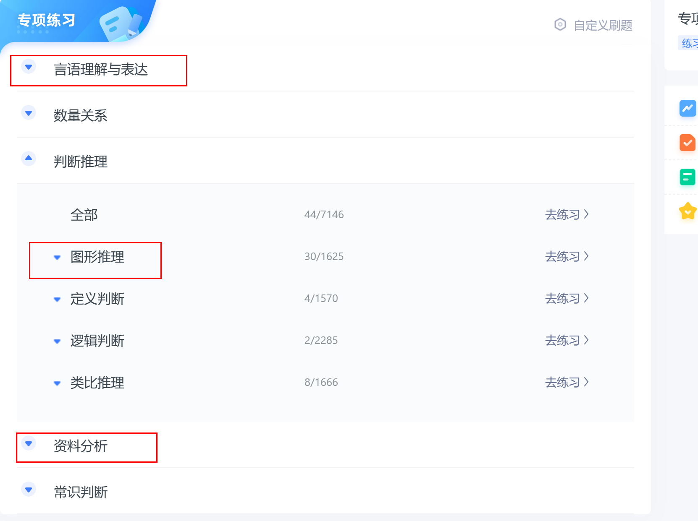

# JavaDreamer

@ author ：developer_zxh

[GitHub](https://github.com/HuaAndLi/JavaDreamer) | [Gitee](暂无)

> - 本项目记录了本人从中国科学院大学硕士研究生开始，Java 开发岗位的学习记录。有兴趣的小伙伴可以与我一起维护。
> - **求个Star**：如果觉得 JavaDreamer 的内容对你有帮助的话，还请点个免费的 Star，这是对我最大的鼓励，感谢各位一起同行，共勉！Github 地址：[https://github.com/HuaAndLi/JavaDreamer](https://github.com/HuaAndLi/JavaDreamer) 。
> - 此笔记均只代表个人观点，如有错误，欢迎指正。
> - 联系方式：qq：1713565983,  加qq，或者qq邮箱都可以。

如果大家没有学习的路线，可以按照如下路线学习。

各科直接没有必要的先后顺序。可以凭借自己的兴趣随意组合。

Java基础开始按照顺序学习。

# 数据结构与算法

## 构建系统知识架构

数据结构与算法部分十分重要，不管是大厂的笔试还是面试中都会涉及到。

首先建议看书或者选择一个视频，系统的学习一下知识体系，本人选择的是《算法图解》，下面是笔记。

[书籍链接](./notebook/algorithm/book_note/算法图解.pdf)

[笔记链接](./notebook/algorithm/book_note/notebook.md)

## 实践网站

系统的学习好之后，就要去实践了。推荐如下两个网站。

[力扣（LeetCode）官网 - 全球极客挚爱的技术成长平台](https://leetcode.cn/)

[牛客网 - 找工作神器|笔试题库|面试经验|实习招聘内推，求职就业一站解决_牛客网 (nowcoder.com)](https://www.nowcoder.com/)

## 分模块练习

由于本人时间较充分，可以按模块刷题。时间紧迫要有所取舍。

### 动态规划

由于动态规划为本人弱项，所以重点刷

网站链接: [动态规划知识点题库 - 力扣（LeetCode）](https://leetcode.cn/tag/dynamic-programming/problemset/?difficulty=Easy&premiumOnly=false)

笔记：[动态规划LeetCode](./notebook/algorithm/study_module/dynamic-programming-leetcode/index.md)

### 回溯法

这个感觉也很难，所以重点刷

网站链接: [题库 - 力扣 (LeetCode) 全球极客挚爱的技术成长平台](https://leetcode.cn/problemset/?topicSlugs=backtracking&page=1&difficulty=EASY)

笔记：[回溯法LeetCode](./notebook/algorithm/study_module/backtracking-leetcode/index.md)

## 热题

时间紧迫可以选择先刷比较重要的题目。

## 随机刷题

由于笔试时，随机抽题，也不会告诉你在属于哪个模块，使用什么相关算法，所以模拟考试非常重要，要自己学会解决问题。

# 行测题

部分大厂笔试会出现行测题，没错就是公务员的行测题。

可以自己选择一个公务员的网址进行刷题。

我个人认为准备的侧重点可以如下图所示。

# Java基础

大厂Java开发，不可能只考虑笔试面试，没有代码能力，所以代码基础与实践相当重要，这里建议找一个课程系统学一下。

下面部分内容由于之前博客已经记录，所以直接给出了博客链接。

## day01

[day01笔记](./notebook/01_javase/day01/index.md)

目录如下：

简介
学什么 怎么学
Java基础目录
计算机基础知识
计算机简介
数据存储和运算
数据运算
常见进制
硬件和软件
计算机语言
人机交互方式
Path环境变量
Java介绍与搭建环境
背景
跨平台
JDK、JRE、JVM
JDK安装
HelloWorld程序
配置Java环境变量
IDEA
注释

## day02

[day02笔记](./notebook/01_javase/day02/index.md)

目录如下：

简介
基础语法
关键字
字面量
变量
Debug工具使用
标识符
数据类型
键盘录入
运算符
package包

## day03

[day03笔记](./notebook/01_javase/day03/index.md)

目录如下：

简介
基础语法
自增自减运算符
类型转化
赋值运算符
关系运算符
三元运算符
逻辑运算符
运算符优先级
分支语句
if语句
课后作业

## day04

[day04笔记](./notebook/01_javase/day04/index.md)

目录如下：

简介
分支语句
switchi语句
循环语句
for语句
while语句
do whilei语句
break和continue
Random随机数
课后作业

## day05

[day05笔记](./notebook/01_javase/day05/index.md)

目录如下：

简介
数组
二维数组
课后作业

## day06

[day06笔记](./notebook/01_javase/day06/index.md)

目录如下：

方法

## day07

[day07笔记](./notebook/01_javase/day07/index.md)

目录如下：

简介
方法的参数传递
课后作业

## day08

[day08笔记](./notebook/01_javase/day08/index.md)

目录如下：

简介
面向对象基础
类和对像
成员变量
this关键字
构造方法
封装
访问权限修饰符
课后作业

## day09

[day09笔记](./notebook/01_javase/day09/index.md) 

目录如下：

简介
字符串
课后作业

## day10

[day10笔记](./notebook/01_javase/day10/index.md) 

目录如下：

简介
集合基础
List
课后作业

# 面向对象进阶

## day01

[day01笔记](./notebook/02_oop/day01/index.md) 

目录如下：

简介
static:关键字
继承

## day02

[day02笔记](./notebook/02_oop/day02/index.md) 

目录如下：

简介
包
权限修饰符
final关键字
常量
枚举
抽象类
接口

## day03

[day03笔记](./notebook/02_oop/day03/index.md) 

目录如下：

简介
面向对象进阶
多态
内部类
Object
Objects
String Builder
System
BigDecimal

## day04

[day04笔记](./notebook/02_oop/day04/index.md) 

目录如下：

简介
日期与时间
Date
SimpleDateFormat
Calendar
JDK8新增日期类
包装类
正则表达式
Arrays工具类
Lambda表达式

## day05

[day05笔记](./notebook/02_oop/day05/index.md) 

目录如下：

简介
集合
Collection
List
泛型

## day06

[day06笔记](./notebook/02_oop/day06/index.md) 

目录如下：

简介
Set
Collections工具类
Map

## day07

[day07笔记](./notebook/02_oop/day07/index.md) 

目录如下：

简介
不可变集合
Stream流
异常处理

## day08

[day08笔记](./notebook/02_oop/day08/index.md) 

目录如下：

简介
日志框架
Logback快速入门
阶段项目实战

## day09

[day09笔记](./notebook/02_oop/day09/index.md) 

目录如下：

简介
File
字符集
io流

## day10

[day10笔记](./notebook/02_oop/day10/index.md) 

目录如下：

简介
1O(补充)
缓冲流
转换流
对象序列化和反序列化
打印流
Properties

## day11

[day11笔记](./notebook/02_oop/day11/index.md) 

目录如下：

简介
多线程
创建方式
线程同步和互斥
线程通信
线程池
定时器

## day12

[day12笔记](./notebook/02_oop/day12/index.md) 

目录如下：

简介
网络编程
网络编程三要素
UDP
TCP

## day13

[day13笔记](./notebook/02_oop/day13/index.md) 

目录如下：

简介
单元测试
反射
获取Class对象
获取构造器对象
获取成员变量
获取方法对象
注解
动态代理

## day14

[day14笔记](./notebook/02_oop/day14/index.md) 

目录如下

简介
XML
文档声明
标签规则
注释
特殊字符处理
文档约束
XML解析
XPath
设计模型

# JavaWeb

MySQL部分，有空可以把代码的空出来看注释练习。这部分有些内容源码过多，后面只列出知识点目录，需要源码的同学可以私聊我。

由于时间紧张，等作者有空会进行补充。

## day01

[day01笔记](./notebook/03_Javaweb/day01/index.md) 

目录如下:

简介
MySQL基础
安装
登录与退出MySQL
DDL操作数据库和表
DML数据的增删攻
查询数据

## day02

[day02笔记](./notebook/03_Javaweb/day02/index.md) 

目录如下:

简介
MySQL高级
约束
事务
多表查询

## day03

[day03笔记](./notebook/03_Javaweb/day03/index.md) 

目录如下:

简介
JDBC
JDBC体验
数据库连接池

## day04

[day04笔记](./notebook/03_Javaweb/day04/index.md) 

目录如下：

简介
Maven
MyBatis入门

## day05

[day05笔记](./notebook/03_Javaweb/day05/index.md) 

目录如下：

简介
MyBatis:进阶
增删改查MyBatis
获取新增记录的主键值
方法多个参数
resultMap输出映射
动态sq

## day06

[day06笔记](./notebook/03_Javaweb/day06/index.md) 

目录如下：

简介
MyBatisi高级
多表关联查询
级联查询懒加载
MyBatis缓存
MyBatisi注解开发

## day07

[day07笔记](./notebook/03_Javaweb/day07/index.md) 

目录如下：

简介
HTML
CSS

## day08

[day08笔记](./notebook/03_Javaweb/day08/index.md) 

目录如下：

简介
JavaScript

## day09

[day09笔记](./notebook/03_Javaweb/day09/index.md) 

目录如下：

简介
HTTP
Web服务器-Tomcat
Servlet

## day10

[day10笔记](./notebook/03_Javaweb/day10/index.md) 

目录如下：

简介
Request
Response

## day11

[day11笔记](./notebook/03_Javaweb/day11/index.md) 

目录如下：

简介
JSP
MVC模型

## day12

[day12笔记](./notebook/03_Javaweb/day12/index.md) 

目录如下：

简介
会话跟踪技术
Cookie
Session

## day13

[day13笔记](./notebook/03_Javaweb/day13/index.md) 

目录如下：

简介
过滤器Filter
监听器Listener
AJAX
Axios

## day14

[day14笔记](./notebook/03_Javaweb/day14/index.md) 

目录如下：

简介
JSON
Vue

## day15

[day15笔记](./notebook/03_Javaweb/day15/index.md) 

目录如下：

简介
Element

## day16

[day16笔记](./notebook/03_Javaweb/day16/index.md) 

目录如下：

简介
综合案例

# Spring等框架

## day01

[day01笔记](./notebook/04_Javaframework/day01/index.md) 

目录如下：

简介
Spring
IoC入门案例(XML版)
DI入门案例(XML版)
bean的作用范围
bean的生命周期

## day02

[day02笔记](./notebook/04_Javaframework/day02/index.md) 

目录如下：

简介
注解开发ioc(重点)
整合MyBatis
整合JUnit

## day03

[day03笔记](./notebook/04_Javaframework/day03/index.md) 

目录如下：

简介
AOP
Spring事务

## day04

[day04笔记](./notebook/04_Javaframework/day04/index.md) 

目录如下：

简介
SpringMVC
Postman
RestFul

## day05

[day05笔记](./notebook/04_Javaframework/day05/index.md) 

目录如下：

简介
拦截器
SSM整合

## day06

[day06笔记](./notebook/04_Javaframework/day06/index.md) 

目录如下：

简介
lombok
Maven高级
私服
依赖关系
分模块

## day07

[day07笔记](./notebook/04_Javaframework/day07/index.md) 

目录如下：

简介
Spring Boot

## day08

[day08笔记](./notebook/04_Javaframework/day08/index.md) 

目录如下：

简介
git

# JVM

# 并发

# 分布式微服务等框架

# Idea好用的插件推荐

- ptg : 根据class已有的属性，快速生成JavaBean
- MybatisX : 快速跳转对应的Mapper接口和xml文件
- JavaToWeb: 将普通的Maven项目转为Web结构下的Maven项目

# 贡献

- 2023.12.05 感谢[徐sir](https://github.com/royxu1972) 发现Java基础下的路径转向错误，已经更正 :thumbsup:  

#  捐赠

如果你觉得这个项目帮助到了你，可以帮作者买杯奶茶或者加个鸡腿🍗表示鼓励。

   
	
    

 

<!-- #end -->

