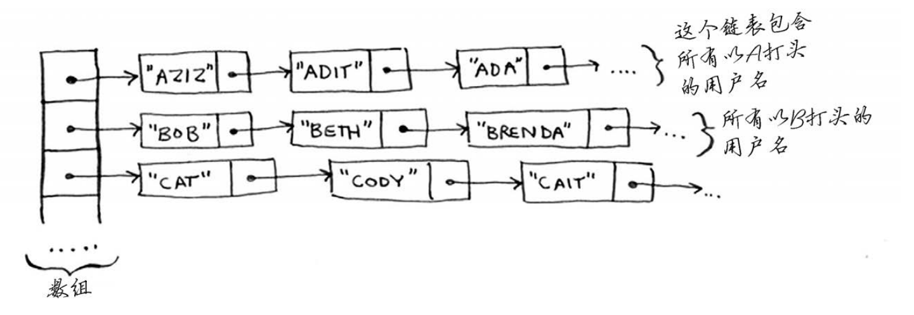
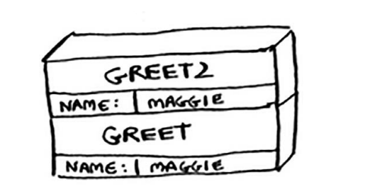
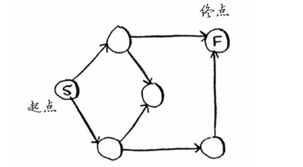
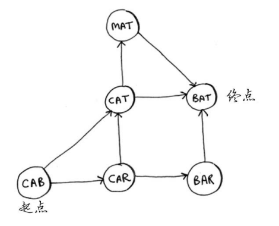
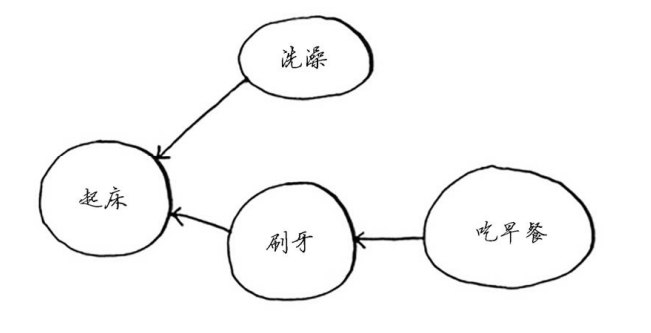
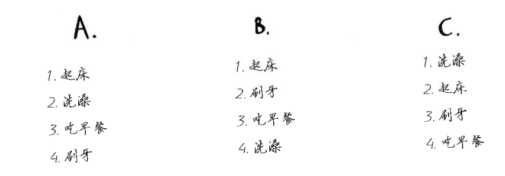
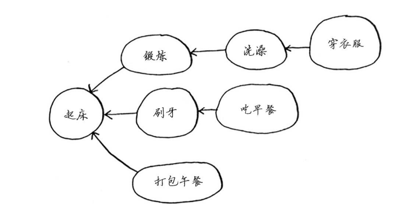
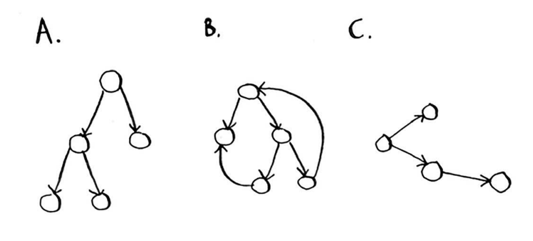
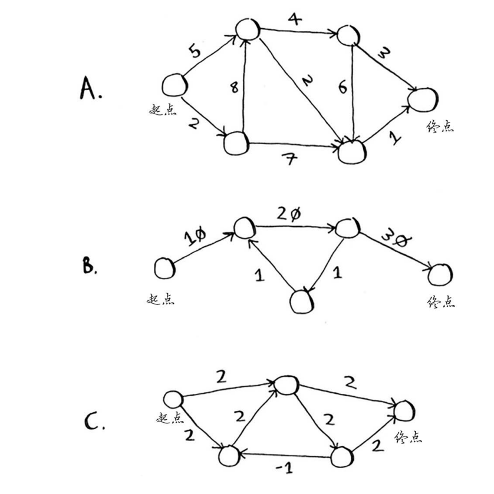

## 简介 

《算法图解》笔记

# 第一章 算法简介

## 代码

### 二分查找

```java
    /**
     * 二分查找
     *
     * @param arr  需要查找的数组
     * @param item 查找的元素
     * @return 返回元素下标
     */
    Integer binary_search(int[] arr, int item) {
        int low = 0;
        int high = arr.length - 1;
        while (low <= high) {
            int mid = (low + high) / 2;
            if (arr[mid] == item) {
                return mid;
            } else if (arr[mid] > item) {
                high = mid - 1;
            } else {
                low = mid + 1;
            }
        }
        return null;
    }

    @Test
    void testMain() {
        int[] my_arr = new int[]{1, 3, 5, 7, 9};

        System.out.println(binary_search(my_arr, 3));//1
        System.out.println(binary_search(my_arr, -1));//null
    }
```


## 练习

**1.1 假设有一个包含128个名字的有序列表，你要使用二分查找在其中查找一个名字，请 问最多需要几步才能找到？** 

log(128) = 7

**1.2 上面列表的长度翻倍后，最多需要几步？**

8

**1.3 在电话簿中根据名字查找电话号码。 使用大O表示法给出下述各种情形的运行时间。**

根据字母姓式二分查找所用时间为:O(log n)

**1.4 在电话簿中根据电话号码找人。（提示：你必须查找整个电话簿。）** 

简单查找，所用时间为:O(n)

**1.5 阅读电话簿中每个人的电话号码。** 

简单查找，所用时间为：O(n)

**1.6 阅读电话簿中姓名以A打头的人的电话号码。这个问题比较棘手，它涉及第4章的概 念。答案可能让你感到惊讶！**

简单查找，所用时间为：O(n)


# 第二章 选择排序

## 代码

### 选择排序

这里书上写的过于复杂，自己实现。

```java
    /**
     * 选择排序
     * 因为引用传递，所以不需要返回值。
     * 思路：遍历数组，每次选择最小值，换到前面。
     *
     * @param arr
     */
    void selectionSort(int[] arr) {
        for (int i = 0; i < arr.length; i++) {
            int minIndex = i;//最小值下标，初试为当前值
            for (int j = i + 1; j < arr.length; j++) {
                if (arr[j] < arr[minIndex]) {
                    minIndex = j;
                }
            }
            int temp = arr[i];//交换位置。
            arr[i] = arr[minIndex];
            arr[minIndex] = temp;
        }

    }

    @Test
    void testMain() {
        int[] my_arr = new int[]{5, 3, 6, 2, 10};
        selectionSort(my_arr);
        Arrays.stream(my_arr).forEach((e) -> System.out.print(e));//235610
    }
```


## 练习

**2.1 假设你要编写一个记账的应用程序。“1.买杂货2.看电影3.会费” 你每天都将所有的支出记录下来，并在月底统计支出，算算当月花了多少钱。因此， 你执行的插入操作很多，但读取操作很少。该使用数组还是链表呢？**

链表，插入O(1),读取O（n）

**2.2 假设你要为饭店创建一个接受顾客点菜单的应用程序。这个应用程序存储一系列点菜 单。服务员添加点菜单，而厨师取出点菜单并制作菜肴。这是一个点菜单队列：服务 员在队尾添加点菜单，厨师取出队列开头的点菜单并制作菜肴。 你使用数组还是链表来实现这个队列呢？（提示：链表擅长插入和删除，而数组擅长 随机访问。在这个应用程序中，你要执行的是哪些操作呢？）** 


使用链表，因为不需要随机访问，只有添加和删除操作。

**2.3 我们来做一个思考实验。假设Facebook记录一系列用户名，每当有用户试图登录 Facebook时，都查找其用户名，如果找到就允许用户登录。由于经常有用户登录 Facebook，因此需要执行大量的用户名查找操作。假设Facebook使用二分查找算法， 而这种算法要求能够随机访问——立即获取中间的用户名。考虑到这一点，应使用数 组还是链表来存储用户名呢？** 

使用数组，目前没有添加操作，并且二分查找必须要随机访问。

**2.4 经常有用户在Facebook注册。假设你已决定使用数组来存储用户名，在插入方面数组 有何缺点呢？具体地说，在数组中添加新用户将出现什么情况？** 

缺点，由于要支持二分查找，所以用户存储必须有序，所以添加新用户，可能需要大量移动元素，时间复杂度：O(n)。并且若内存中位置不足，需要全部移动位置。

**2.5 实际上，Facebook存储用户信息时使用的既不是数组也不是链表。假设Facebook使用 的是一种混合数据：链表数组。这个数组包含26个元素，每个元素都指向一个链表。 例如，该数组的第一个元素指向的链表包含所有以A打头的用户名，第二个元素指向的 链表包含所有以B打头的用户名，以此类推。 假设Adit B在Facebook注册，而你需要将其加入前述数据结构中。因此，你访问数组的 第一个元素，再访问该元素指向的链表，并将Adit B添加到这个链表末尾。现在假设你要查找Zakhir H。因此你访问第26个元素，再在它指向的链表（该链表包含所有以z打 头的用户名）中查找Zakhir H。 请问，相比于数组和链表，这种混合数据结构的查找和插入速度更慢还是更快？你不 必给出大O运行时间，只需指出这种新数据结构的查找和插入速度更快还是更慢。**



这种数据结构，相比于数组，插入更快，查找稍慢。相比于链表查找较快，插入较慢。

# 第三章 递归

## 代码

**递归倒计时**

```java
    /**
     * 递归倒计时
     *
     * @param time 开始的倒计时
     *             输出：time time-1 ... time-n;
     */
    static void countDown(int time) {
        if (time < 1) {
            return;
        } else {
            System.out.println(time);
            countDown(time - 1);
        }
    }

    public static void main(String[] args) {
        countDown(5);// 5 4 3 2 1
    }

```

**递归阶乘**

```java
    /**
     * 递归阶乘
     *
     * @param n
     * @return n!
     */
    static int facMul(int n) {
        if (n <= 1) {
            return 1;
        } else {
            return n * facMul(n - 1);
        }
    }
    public static void main(String[] args) {
        System.out.println(facMul(4));//24
    }

```


## 练习

**3.1 根据下面的调用栈，你可获得哪些信息？**



greet方法先被调用，name参数出入maggle

great方法中调用了greet2方法，name参数传入maggle

此时greet未完成

正在调用greet2，若greet2中无其他调用方法，greet2调用玩，返回greet方法继续执行。

**3.2 假设你编写了一个递归函数，但不小心导致它没完没了地运行。正如你看到的，对于 每次函数调用，计算机都将为其在栈中分配内存。递归函数没完没了地运行时，将给 栈带来什么影响？**

内存溢出。


# 第四章 快速排序 分而治之


## 代码

### 快速排序

按照书的思路，由于是python转java可能有些复杂。

```java
int[] quicksort(int[] array) {
        if (array.length < 2) {
            return array;
        } else {
            int pivot = array[0];
            int[] less = IntStream.range(1, array.length).filter(i -> array[i] <= pivot).map(i->array[i]).toArray();
            int[] greater = IntStream.range(1, array.length).filter(i -> array[i] > pivot).map(i->array[i]).toArray();

            less = quicksort(less);
            greater = quicksort(greater);
            int[] merge = new int[less.length + greater.length + 1];
            System.arraycopy(less, 0, merge, 0, less.length);
            merge[less.length] = pivot;
            System.arraycopy(greater, 0, merge, less.length + 1, greater.length);
            return merge;
        }
    }

    @Test
    void testMain() {
        int[] my_arr = new int[]{8, 2, 6, 3, 10};
        int[] new_arr = quicksort(my_arr);
        Arrays.stream(new_arr).forEach(i -> System.out.println(i));
    }
```


## 练习

**4.1 请编写前述sum函数的代码。** 

```java
    /**
     * 分而治之 递归累计数组(使用书上的思想，但是空间复杂度会很高)
     *
     * @param arr
     * @return
     */
    int sum(int[] arr) {
        if (arr.length <= 1) {
            return arr[0];
        } else {
            int[] newArr = IntStream.range(1, arr.length).map(i -> arr[i]).toArray();
            return arr[0] + sum(newArr);
        }
    }

    @Test
    void testMain() {
        int[] my_arr = new int[]{5, 3, 6, 2, 10};
        System.out.println(sum(my_arr));//26
    }
```

**4.2 编写一个递归函数来计算列表包含的元素数。** 

```java
/**
     * 分而治之 递归数组长度,只需要将上面代码累加变成1即可
     *
     * @param arr
     * @return
     */
    int sum(int[] arr) {
        if (arr.length <= 1) {
            return 1;
        } else {
            int[] newArr = IntStream.range(1, arr.length).map(i -> arr[i]).toArray();
            return 1 + sum(newArr);
        }
    }
```

**4.3 找出列表中最大的数字。** 

```java
    /**
     * 分而治之 递归  同样的结构，改变基线条件和递归条件。
     *
     * @param arr
     * @return
     */
    int sum(int[] arr) {
        if (arr.length <= 1) {
            return arr[0];
        } else {
            int[] newArr = IntStream.range(1, arr.length).map(i -> arr[i]).toArray();
            return Math.max(arr[0], sum(newArr));
        }
    }
```

**4.4 还记得第1章介绍的二分查找吗？它也是一种分而治之算法。你能 找出二分查找算法的基线条件和递归条件吗？**

```java
    /**
     * 二分查找 ，数组升序
     *
     * @param arr 需要查找的数组
     * @param item 查找的数
     * @param low 从哪里开始查找
     * @param high 到哪里结束
     * @return 下标
     */
    Integer binarySearch(int[] arr, int item, int low, int high) {
        if (low <= high) {
            int mid = (high + low) / 2;
            if (arr[mid] == item) {
                return mid;
            } else if (arr[mid] < item) {
                return binarySearch(arr, item, mid + 1, high);
            } else {
                return binarySearch(arr, item, low, mid - 1);
            }
        } else {
            return null;
        }
    }

    @Test
    void testMain() {
        int[] my_arr = new int[]{2, 3, 6, 8, 10};
        System.out.println(binarySearch(my_arr, 3, 0, my_arr.length-1));//1
    }
```


**使用大O表示法时，下面各种操作都需要多长时间？** 

**4.5 打印数组中每个元素的值。** 

O(n)

**4.6 将数组中每个元素的值都乘以2。** 

O(n)

**4.7 只将数组中第一个元素的值乘以2。**

O(1)

**4.8 根据数组包含的元素创建一个乘法表，即如果数组为[2, 3, 7, 8, 10]，首先将每个元素 都乘以2，再将每个元素都乘以3，然后将每个元素都乘以7，以此类推。**

O( $n^2$ )


# 第五章 散列表


## 练习

**对于同样的输入，散列表必须返回同样的输出，这一点很重要。如果不是这样的，就无法找到你在散列表中添加的元素！ 请问下面哪些散列函数是一致的？**

**5.1 f(x) = 1 无论输入是什么，都返回1**

一致。

**5.2 f(x) = rand()  每次都返回一个随机数**

不一致。

**5.3 f(x) = next_empty_slot()  返回散列表中下一个 空位置的索引**

不一致。

**5.4 f(x) = len(x) 将字符串的长度用作索引**

一致。


**散列函数的结果必须是均匀分布的，这很重要。它们的映射范围必须尽可能大。最糟糕的散 列函数莫过于将所有输入都映射到散列表的同一个位置。 假设你有四个处理字符串的散列函数。**

 **A. 不管输入是什么，都返回1。** 

**B. 将字符串的长度用作索引。** 

**C. 将字符串的第一个字符用作索引。即将所有以a打头的字符串都映射到散列表的同一个位 置，以此类推。** 

**D. 将每个字符都映射到一个素数：a = 2，b = 3，c = 5，d = 7，e = 11，等等。对于给定的字 符串，这个散列函数将其中每个字符对应的素数相加，再计算结果除以散列表长度的余数。 例如，如果散列表的长度为10，字符串为bag，则索引为(3 + 2 + 17) % 10 = 22 % 10 = 2。**

**在下面的每个示例中，上述哪个散列函数可实现均匀分布？假设散列表的长度为10。** 

**5.5 将姓名和电话号码分别作为键和值的电话簿，其中联系人姓名为Esther、Ben、Bob和 Dan。** 

D

**5.6 电池尺寸到功率的映射，其中电池尺寸为A、AA、AAA和AAAA。** 

B 长度不同；D 2 4 6 8；

**5.7 书名到作者的映射，其中书名分别为Maus、Fun Home和Watchmen。**

C 首字母不同。


# 第六章 广度优先搜索


## 练习

**对于下面的每个图，使用广度优先搜索算法来找出答案。**

 **6.1 找出从起点到终点的最短路径的长度。** 



2步。

**6.2 找出从cab到bat的最短路径的长度。**



2 步。


**下面的小图说明了我早晨起床后要做的事情。**



**该图指出，我不能没刷牙就吃早餐，因此“吃早餐”依赖于“刷牙”。 另一方面，洗澡不依赖于刷牙，因为我可以先洗澡再刷牙。根据这个图，可创建一个列表， 指出我需要按什么顺序完成早晨起床后要做的事情：**

**(1) 起床** 

**(2) 洗澡** 

**(3) 刷牙** 

**(4) 吃早餐** 

**请注意，“洗澡”可随便移动，因此下面的列表也可行：** 

**(1) 起床** 

**(2) 刷牙**

 **(3) 洗澡** 

**(4) 吃早餐** 

**6.3 请问下面的三个列表哪些可行、哪些不可行？**



B 可以

A，C不行

**6.4 下面是一个更大的图，请根据它创建一个可行的列表。**



起床->锻炼-洗澡-穿衣服-刷牙-吃早饭-打包午餐


**6.5 请问下面哪个图也是树？**



A C


# 第七章 狄克斯特拉算法

## 练习

**7.1 在下面的各个图中，从起点到终点的最短路径的总权重分别是多少？**



A  8

B 60

C 4


# 第八章 贪婪算法


## 练习

**8.1 你在一家家具公司工作，需要将家具发往全国各地，为此你需要将箱子装上卡车。每 个箱子的尺寸各不相同，你需要尽可能利用每辆卡车的空间，为此你将如何选择要装 上卡车的箱子呢？请设计一种贪婪算法。使用这种算法能得到最优解吗？**

每次装尽可能大的箱子。

**8.2 你要去欧洲旅行，总行程为7天。对于每个旅游胜地，你都给它分配一个价值——表示你有多想去那里看看，并估算出需要多长时间。你如何将这次旅行的价值最大化？ 请设计一种贪婪算法。使用这种算法能得到最优解吗？**

依次选最大的价值。

**下面各种算法是否是贪婪算法。**

 **8.3 快速排序。** 

不是

**8.4 广度优先搜索。** 

是

**8.5 狄克斯特拉算法。**

是


**8.6 有个邮递员负责给20个家庭送信，需要找出经过这20个家庭的最短路径。请问这是一 个NP完全问题吗？** 

是NP完全

**8.7 在一堆人中找出最大的朋友圈（即其中任何两个人都相识）是NP完全问题吗？** 

是NP完全

**8.8 你要制作美国地图，需要用不同的颜色标出相邻的州。为此，你需要确定最少需要使 用多少种颜色，才能确保任何两个相邻州的颜色都不同。请问这是NP完全问题吗？**

是NP完全

